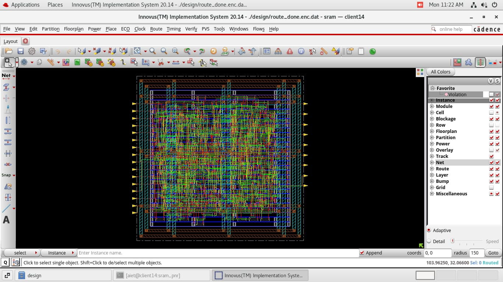
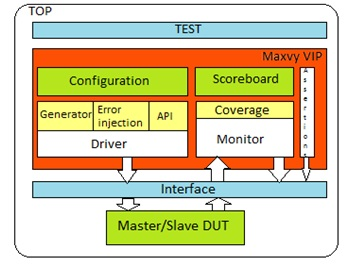

<!-- ========================= HEADER ========================= -->


<!-- ========================= INTRO ========================= -->

<h1 align="center">Hi 👋, I'm Shivanand Hanchinal</h1>

<h3 align="center">
ECE Undergraduate • VLSI & ASIC Physical Design • Analog Layout • SystemVerilog/UVM
</h3>

<p align="center">
  
</p>

<p align="center">
  <a href="https://github.com/ShivuAH">
    
  </a>
  
  
</p>

---

# 👨‍💻 About Me

🎓 **B.E. Electronics & Communication Engineering** undergraduate at
**Alva's Institute of Engineering and Technology**, graduating in **2027**.

I am focused on **VLSI and semiconductor design**, with hands-on experience in:

* 🔹 ASIC Physical Design
* 🔹 RTL-to-GDSII implementation
* 🔹 Analog & Custom IC Layout
* 🔹 CMOS and MOSFET fundamentals
* 🔹 Static Timing Analysis
* 🔹 SystemVerilog & UVM Verification
* 🔹 AMBA AHB protocol verification
* 🔹 Linux-based EDA workflows

I enjoy translating digital designs into physical implementations and developing a deeper understanding of **timing, power, area, routing, verification, and semiconductor design methodologies**.

---

# ⚡ Core Expertise

<table>
<tr>
<td width="50%" valign="top">

### 🏗️ ASIC Physical Design

* RTL-to-GDSII Flow
* Floorplanning
* Power Planning
* IO Pin Placement
* Standard Cell Placement
* Clock Tree Synthesis
* CCOpt
* NanoRoute
* Static Timing Analysis
* MCMM
* Setup / Hold Analysis
* DRC / LVS
* GDSII

</td>

<td width="50%" valign="top">

### 🔬 Analog & Custom Design

* CMOS Inverter
* MOSFET Biasing
* Common Source
* Common Gate
* Common Drain
* Single-Stage Op-Amp
* Custom Analog Layout
* DRC / LVS Verification
* RC Transient Analysis
* RLC Circuits
* Device Fundamentals

</td>
</tr>

<tr>
<td width="50%" valign="top">

### 🧪 Verification

* SystemVerilog
* UVM
* SVA
* Constrained-Random Testing
* Functional Coverage
* Driver
* Monitor
* Sequencer
* Scoreboard
* TLM Analysis Ports
* AMBA AHB

</td>

<td width="50%" valign="top">

### 💻 Programming & Tools

* TCL
* C
* Python
* Linux
* Git
* GitHub
* Cadence Innovus
* Cadence Genus
* Cadence Virtuoso
* 45nm GSCLIB PDK
* LEF / DEF / LIB / SDC

</td>
</tr>
</table>

---

# 🛠️ Technology Stack

### EDA & VLSI

<p>


</p>

### Hardware Description & Verification

<p>


</p>

### Programming & Development

<p>


</p>

---

# 🔄 ASIC Physical Design Flow

<p align="center">


</p>

<p align="center">
<b>RTL → Synthesis → Floorplanning → Power Planning → Placement → CTS → Routing → STA → Physical Verification → GDSII</b>
</p>

---

# 🚀 Featured VLSI Projects

## 🔬 01 — 45nm SRAM Controller Physical Design

<p align="center">
  
</p>

<p align="center">
  <i>45nm SRAM Controller — Physical Design Implementation</i>
</p>

**8-bit × 16-word SRAM Controller | 900 Instances | 5.4 ns Clock**

<a href="https://github.com/ShivuAH/sram-physical-design-45nm">

</a>

### Implementation

* Executed complete **RTL-to-GDSII PnR flow** at 45nm.
* Targeted a **5.4 ns clock period**.
* Implemented automated floorplanning using TCL.
* Performed Metal5 IO placement.
* Generated Metal8/9 power-grid mesh.
* Executed standard-cell placement.
* Performed CTS using Cadence Innovus.
* Analyzed post-CTS timing.
* Resolved hold violations using buffer insertion.
* Completed global and detailed routing.
* Performed DRC/LVS and connectivity verification.

**Tools:** `Innovus` `Genus` `TCL` `Linux` `45nm GSCLIB PDK`

---

## 🧮 02 — 45nm 32-bit ALU Physical Design

<p align="center">
  
</p>

<p align="center">
  <i>45nm 32-bit ALU — Floorplanning and Physical Implementation</i>
</p>

**32-bit ALU | 5.4 ns Clock Target | RTL-to-GDSII**

<a href="https://github.com/ShivuAH/alu-physical-design-45nm">

</a>

### Implementation

* Executed netlist-to-GDSII physical design flow.
* Designed floorplan and IO pin placement.
* Implemented power planning.
* Performed standard-cell placement.
* Implemented **Clock Tree Synthesis using CCOpt**.
* Executed NanoRoute global and detailed routing.
* Performed MCMM timing analysis.
* Analyzed setup and hold timing.
* Completed physical verification and connectivity checks.

**Tools:** `Innovus` `Genus` `TCL` `SDC` `MMMC` `45nm GSCLIB PDK`

---

# 🧪 03 — AMBA AHB Memory Controller Verification

<p align="center">
  
</p>

<p align="center">
  <i>UVM-based AMBA AHB Memory Controller Verification Environment</i>
</p>

**SystemVerilog | UVM | SVA | Ongoing**

### Verification Environment

```text
                    ┌──────────────────┐
                    │   Test / Config  │
                    └────────┬─────────┘
                             │
                    ┌────────▼─────────┐
                    │    Sequencer     │
                    └────────┬─────────┘
                             │
                    ┌────────▼─────────┐
                    │      Driver      │
                    └────────┬─────────┘
                             │
                    ┌────────▼─────────┐
                    │       DUT        │
                    │  AHB Controller  │
                    └────────┬─────────┘
                             │
                    ┌────────▼─────────┐
                    │     Monitor      │
                    └────────┬─────────┘
                             │
                    ┌────────▼─────────┐
                    │    Scoreboard    │
                    └──────────────────┘
```

### Current Work

* Developing UVM verification environment.
* Implementing Driver, Monitor, Sequencer and Scoreboard.
* Using TLM analysis ports for transaction-level checking.
* Developing constrained-random test sequences.
* Writing SVA properties for protocol behavior.
* Verifying read/write transactions.
* Checking AHB handshaking and timing.
* Working toward functional coverage closure.

**Technologies:** `SystemVerilog` `UVM` `SVA` `AMBA AHB`

---

# 📸 VLSI Design Gallery

> Screenshots from Cadence Innovus, Genus and Virtuoso implementations will be added here.

<table>
<tr>
<td align="center">

<br/>
<b>SRAM Floorplan</b>
</td>

<td align="center">

<br/>
<b>32-bit ALU Floorplan</b>
</td>
</tr>
</table>

<p align="center">
<i>Physical design results and EDA screenshots from project implementations.</i>
</p>

---

# 📚 Certifications

| Certification                                   | Platform |
| ----------------------------------------------- | -------- |
| Digital Systems: From Logic Gates to Processors | Coursera |
| Signal Processing Algorithms and Architectures  | NPTEL    |

---

# 🏆 Achievement

<p align="center">


</p>

### 🥇 1st Place — TECHNOVATE 2025

**Alva's Institute of Engineering and Technology**

🏅 **1st Place among 120+ teams**

**Track:** Hardware & Embedded Systems

---

# 🎯 Current Focus

<table>
<tr>
<td align="center">🏗️<br/><b>ASIC Physical Design</b></td>
<td align="center">🔬<br/><b>Analog Layout</b></td>
<td align="center">⏱️<br/><b>Timing Closure</b></td>
<td align="center">🧪<br/><b>UVM Verification</b></td>
</tr>
</table>

Currently strengthening my practical knowledge in:

* ASIC Physical Design
* Cadence Innovus / Genus
* Cadence Virtuoso
* SystemVerilog
* UVM
* SVA
* AMBA AHB
* Timing Analysis
* CMOS / Analog Design

---

# 📊 GitHub Analytics

<p align="center">


</p>

<p align="center">


</p>

---

# 📈 Contribution Activity

<p align="center">


</p>

---

# 📌 Repository Highlights

<p align="center">

<a href="https://github.com/ShivuAH/sram-physical-design-45nm">

</a>

<a href="https://github.com/ShivuAH/alu-physical-design-45nm">

</a>

</p>

---

# 🤝 Connect With Me

<p align="center">

<a href="https://github.com/ShivuAH">

</a>

<a href="https://www.linkedin.com/in/shiviuah">

</a>

<a href="mailto:shivananadhanchinal47@gmail.com">

</a>

</p>

---

# 💬 Engineering Philosophy

<p align="center">

> **"Design with precision. Verify with confidence. Build with purpose."**

</p>

---

<p align="center">


### ⚡ Learn • Design • Verify • Build

**Thanks for visiting my profile!**

⭐ Explore my repositories • 💻 Follow my VLSI journey • 🤝 Let's connect

</p>
